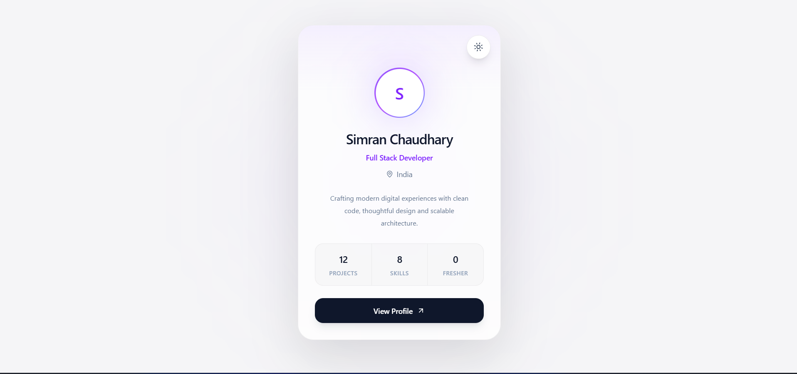
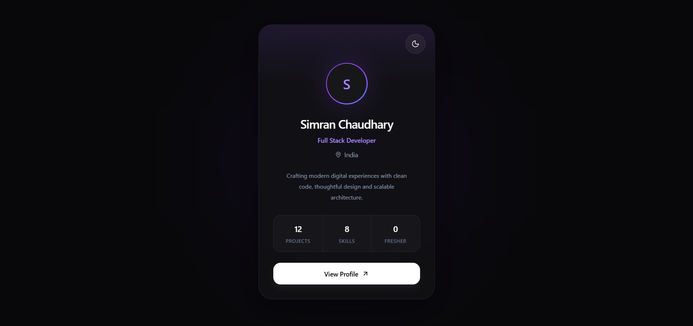

# 🌙 React Theme Changer

A modern and responsive profile card UI built with **React.js** and **Tailwind CSS**, featuring a smooth Light/Dark theme switching experience.

The project focuses on building a clean, premium-looking interface while practicing **React Context API**, reusable components, Tailwind CSS, and interactive UI animations.

---

## ✨ Features

- ☀️ Light Mode
- 🌙 Dark Mode
- 🔄 Smooth theme switching
- 🎨 Modern and minimal profile card UI
- ⚛️ React Context API for theme management
- 🌓 Dynamic Sun/Moon theme icons
- ✨ Smooth hover and transition animations
- 📱 Responsive design
- 🧩 Reusable React components
- 🎯 Clean and organized project structure

---

## 🛠️ Tech Stack

| Technology | Usage |
|---|---|
| ⚛️ React.js | Frontend UI |
| 🎨 Tailwind CSS | Styling |
| 🟨 JavaScript | Application logic |
| 🌙 Lucide React | Icons |
| ⚡ Vite | Development & build tool |

---

## 📸 Preview

### ☀️ Light Mode

> 

### 🌙 Dark Mode

>  

---

## 🧠 What I Learned

While building this project, I practiced:

- Understanding React Context API
- Creating and consuming custom hooks
- Managing global theme state
- Implementing Light/Dark mode
- Using Tailwind CSS dark mode utilities
- Creating reusable React components
- Handling user interactions with event handlers
- Adding smooth CSS transitions and animations
- Structuring a React project cleanly

---

## 📂 Project Structure

```text
src/
│
├── components/
│   ├── Content.jsx
│   ├── ProfileBtn.jsx
│   ├── Status.jsx
│   └── ThemeBtn.jsx
│
├── contexts/
│   └── Theme.js
│
├── App.jsx
├── main.jsx
└── index.css
